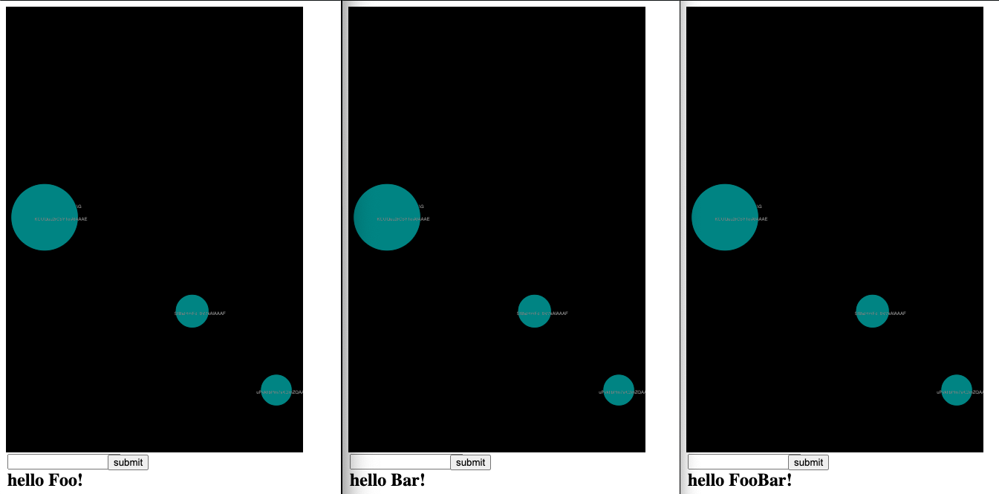

# Lick the toad
Sonification project using machine learning.

Some primary videos demonstrating the project [here](https://www.youtube.com/playlist?list=PLiCZTYIqSUAb1J-Iu4lhVwDz6ljKCVj-W)

## Overview of the project
This project aims to explore the idea of remoteness & isolation. It offers two Modus Operandi: 

### User Interface
Live Input of an X/Y position of the screen using a ball object.

custom made system that acts as a digital bridge over interconnected peers across the network using a web interface a URL. 
At the moment the system uses a model to train a neural network and provide prediction output using [regression](https://en.wikipedia.org/wiki/Regression_analysis) which is used as raw material for real time sound synthesis algorithms implemented in SuperCollider. 
The generated output can control real time sonfication algorithms which will run independently, but it may also be used as raw material for live coding and thusly expand on other performance possibilities and interactive media making it a highly flexible and versatile project. 
This project stems from my personal interest using custom made generative systems enacting human intervention with computer generated sound synthesis and sonification. While this provides a minimal approach of user interaction, no complications attached, it also provides a medium to collaborate with other logged users locally and/or remotely. 

## Technical specifications
The system is developed as a cross platform application running on NodeJS, and JavaScript and [SuperCollider](https://supercollider.github.io), and [ml5](https://ml5js.org) for the implementation of machine learning capabilities.

## Acknowledgments
I would like to express my gratitude to Dan Shiffman and his invaluable tutorials on [P5.js](https://p5js.org) and [ml5](https://ml5js.org).

